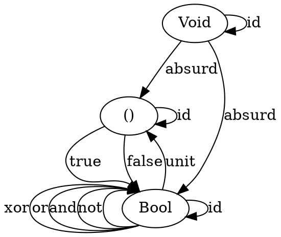
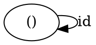
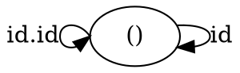
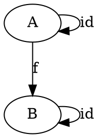
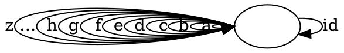

# Category Theory For Programmers Challenges
My solutions to Bartosz Milewski "Category Theory for Programmers" challenges.

## 1.4

### 1. Implement, as best as you can, the identity function in your favorite language (or the second favorite, if your favorite language happens to be Haskell).

```python
# the identity arrow is implemented as the identity function that just returns back its argument.

def identity(x):
    return x
```	

### 2. Implement the composition function in your favorite language. It takes two functions as arguments and returns a function that is their composition.

```python
def compose (f, g):
    return lambda x: f(g(x))


```
(see full example at 1.4.2.py)

```haskell
h :: (b -> c) -> (a -> b) -> a -> c
h f g = f . g
```

### 3. Write a program that tries to test that your composition function respects identity.

Function comparison for partial functions is undefined for Turing Machin in general case, because of the Halting Problem.
Functions might be compared:
- lexically (possibly via reduction)
- by comparing samples of function return values for a number of samples, or for all samples in case of total functions.
- in case of composition with identity, we could cheat by defining the following (in haskell):
```haskell 
id . f == f . id
```

### 4. Is the world-wide web a category in any sense? Are links morphisms?

If links are composable, then they are morphisms, in which case WWW is a category.

### 5. Is Facebook a category, with people as objects and friendships as morphisms?

Friendships do not compose in general, hence they are not morphisms.

### 6. When is a directed graph a category?

When a directed graph's edges are associative, compose and every node has an identity morphism, then such directed graph is a category.

## 2.7

### 1. Define a higher-order function (or a function object) memoize in your favorite language. This function takes a pure function f as an argument and returns a function that behaves almost exactly like f , except that it only calls the original function once for every argument, stores the result internally, and subsequently returns this stored result every time it’s called with the same argument. You can tell the memoized function from the original by watching its performance. For instance, try to memoize a function that takes a long time to evaluate. You’ll have to wait for the result the first time you call it, but on subsequent calls, with the same argument, you should get the result immediately.

```python
import math

def memoize(f):
    memo = {}
    def memoized(x):
        if x not in memo:
            memo[x] = f(x)
        return memo[x]
    return memoized

# Use example:
# $ python
# > import math
# > import _271
# > fact = _271.memoize(math.factorial)
# > fact(1000000)

```

### 2. Try to memoize a function from your standard library that you normally use to produce random numbers. Does it work?

No, it does not work.

### 3. Most random number generators can be initialized with a seed. Implement a function that takes a seed, calls the random number generator with that seed, and returns the result. Memoize that function. Does it work?

It works, provided the random number generator seed value can be fixed, e.g.:

```python
import random

# define a random number generator with seed:
def rand(seed):
    fseed = math.factorial(1000000) # make it slow to compute i.o.t. test memorization
    random.seed(fseed)
    return random.random()

# > mrand = _271.memoize(_271.rand)
# > mrand(10)
# 0.27256627902952435
```

### 5. How many different functions are there from Bool to Bool ? Can you implement them all?

There are 4 basic functions `Bool -> Bool`:
``` haskell
not :: Bool -> Bool
and :: Bool -> Bool
or  :: Bool -> Bool
xor :: Bool -> Bool

```
and infinitely many compositions of these 4 basic functions.  I don't think that I can implement them all.

### 6. Draw a picture of a category whose only objects are the types Void , () (unit), and Bool ; with arrows corresponding to all possible functions between these types. Label the arrows with the names of the functions.




## 3.6.

### 1. Generate a free category from:

#### (a) A graph with one node and no edges.




#### (b) A graph with one node and one (directed) edge (hint: this edge can be composed with itself).




#### (c) A graph with two nodes and a single arrow between them.




#### (d) A graph with a single node and 26 arrows marked with the letters of the alphabet: a, b, c … z.




### 2. What kind of order is this?

#### (a) A set of sets with the inclusion relation: 𝐴 is included in 𝐵 if every element of 𝐴 is also an element of 𝐵.

A ⊆ B, if ∀x ∈ A : x ∈ B.
if ∀y ∈ B : y ∈ A ∴ B ⊆ A
∴ (A ⊆ B)^(B ⊆ A) ∴ A = B

Hence, it's a Partial Order
